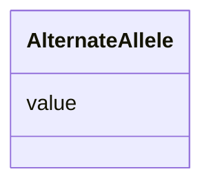

# Class: AlternateAllele 


_Represents the AlternateAllele, found upon mapping (genome) read sequencing from a sample to the reference sequence._


URI: [geno:0000002](http://purl.obolibrary.org/obo/GENO_0000002)





<!-- no inheritance hierarchy -->


## Slots

| Name | Cardinality and Range | Description | Inheritance |
| ---  | --- | --- | --- |
| [value](value.md) | 1 <br/> [String](String.md) | The nucleic composition of the alternate allele | direct |


## Usages

| used by | used in | type | used |
| ---  | --- | --- | --- |
| [AlternateAllele](AlternateAllele.md) | [value](value.md) | domain | [AlternateAllele](AlternateAllele.md) |
| [SequenceAlteration](SequenceAlteration.md) | [has_alternate_part](has_alternate_part.md) | range | [AlternateAllele](AlternateAllele.md) |


## Identifier and Mapping Information


### Schema Source


* from schema: https://w3id.org/neugenfair/schema


## Mappings

| Mapping Type | Mapped Value |
| ---  | ---  |
| self | geno:0000002 |
| native | https://w3id.org/neugenfair/schema/AlternateAllele |


## LinkML Source

<!-- TODO: investigate https://stackoverflow.com/questions/37606292/how-to-create-tabbed-code-blocks-in-mkdocs-or-sphinx -->

### Direct

<details>
```yaml
name: AlternateAllele
description: Represents the AlternateAllele, found upon mapping (genome) read sequencing
  from a sample to the reference sequence.
from_schema: https://w3id.org/neugenfair/schema
attributes:
  value:
    name: value
    description: The nucleic composition of the alternate allele.
    from_schema: https://w3id.org/neugenfair/schema
    exact_mappings:
    - sio:000300
    domain: AlternateAllele
    slot_uri: sio:000300
    domain_of:
    - AlternateAllele
    - ReferenceAllele
    range: string
    required: true
class_uri: geno:0000002

```
</details>

### Induced

<details>
```yaml
name: AlternateAllele
description: Represents the AlternateAllele, found upon mapping (genome) read sequencing
  from a sample to the reference sequence.
from_schema: https://w3id.org/neugenfair/schema
attributes:
  value:
    name: value
    description: The nucleic composition of the alternate allele.
    from_schema: https://w3id.org/neugenfair/schema
    exact_mappings:
    - sio:000300
    domain: AlternateAllele
    slot_uri: sio:000300
    alias: value
    owner: AlternateAllele
    domain_of:
    - AlternateAllele
    - ReferenceAllele
    range: string
    required: true
class_uri: geno:0000002

```
</details>