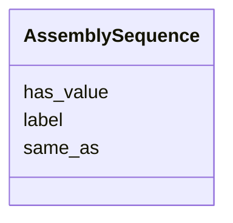

# Class: AssemblySequence 


_AssemblySequence is a chromosome or sequence in a reference genome._


URI: [so:0000353](http://purl.obolibrary.org/obo/SO_0000353)





<!-- no inheritance hierarchy -->


## Slots

| Name | Cardinality and Range | Description | Inheritance |
| ---  | --- | --- | --- |
| [has_value](has_value.md) | 0..1 <br/> [String](String.md) |  | direct |
| [label](label.md) | 0..1 <br/> [String](String.md) |  | direct |
| [same_as](same_as.md) | 0..1 <br/> [String](String.md) |  | direct |


## Identifier and Mapping Information


### Schema Source


* from schema: https://w3id.org/neugenfair/schema


## Mappings

| Mapping Type | Mapped Value |
| ---  | ---  |
| self | so:0000353 |
| native | https://w3id.org/neugenfair/schema/AssemblySequence |
| exact | geno:0000960 |
| related | go:0005694, sio:000899 |


## LinkML Source

<!-- TODO: investigate https://stackoverflow.com/questions/37606292/how-to-create-tabbed-code-blocks-in-mkdocs-or-sphinx -->

### Direct

<details>
```yaml
name: AssemblySequence
description: AssemblySequence is a chromosome or sequence in a reference genome.
from_schema: https://w3id.org/neugenfair/schema
exact_mappings:
- geno:0000960
related_mappings:
- go:0005694
- sio:000899
attributes:
  has_value:
    name: has_value
    from_schema: https://w3id.org/neugenfair/schema
    domain_of:
    - AssemblySequence
    - VariantIdentifier
  label:
    name: label
    from_schema: https://w3id.org/neugenfair/schema
    domain_of:
    - AssemblySequence
  same_as:
    name: same_as
    from_schema: https://w3id.org/neugenfair/schema
    domain_of:
    - AssemblySequence
class_uri: so:0000353

```
</details>

### Induced

<details>
```yaml
name: AssemblySequence
description: AssemblySequence is a chromosome or sequence in a reference genome.
from_schema: https://w3id.org/neugenfair/schema
exact_mappings:
- geno:0000960
related_mappings:
- go:0005694
- sio:000899
attributes:
  has_value:
    name: has_value
    from_schema: https://w3id.org/neugenfair/schema
    alias: has_value
    owner: AssemblySequence
    domain_of:
    - AssemblySequence
    - VariantIdentifier
  label:
    name: label
    from_schema: https://w3id.org/neugenfair/schema
    alias: label
    owner: AssemblySequence
    domain_of:
    - AssemblySequence
  same_as:
    name: same_as
    from_schema: https://w3id.org/neugenfair/schema
    alias: same_as
    owner: AssemblySequence
    domain_of:
    - AssemblySequence
class_uri: so:0000353

```
</details>