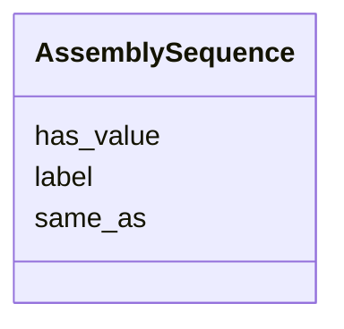

# Class: AssemblySequence 


_AssemblySequence is a chromosome or sequence in a reference genome._


URI: [so:0000353](http://purl.obolibrary.org/obo/SO_0000353)





<!-- no inheritance hierarchy -->


## Slots

| Name | Cardinality and Range | Description | Inheritance |
| ---  | --- | --- | --- |
| [has_value](has_value.md) | 1 <br/> [String](String.md) | Sequence name | direct |
| [label](label.md) | 0..1 <br/> [String](String.md) | A human-readable relatable name for the sequence (e | direct |
| [same_as](same_as.md) | 0..1 <br/> [String](String.md) | Link to an external reference for the sequence (e | direct |


## Usages

| used by | used in | type | used |
| ---  | --- | --- | --- |
| [AssemblySequence](AssemblySequence.md) | [has_value](has_value.md) | domain | [AssemblySequence](AssemblySequence.md) |
| [AssemblySequence](AssemblySequence.md) | [label](label.md) | domain | [AssemblySequence](AssemblySequence.md) |
| [AssemblySequence](AssemblySequence.md) | [same_as](same_as.md) | domain | [AssemblySequence](AssemblySequence.md) |
| [Region](Region.md) | [has_reference](has_reference.md) | range | [AssemblySequence](AssemblySequence.md) |


## Identifier and Mapping Information


### Schema Source


* from schema: https://w3id.org/neugenfair/schema


## Mappings

| Mapping Type | Mapped Value |
| ---  | ---  |
| self | so:0000353 |
| native | https://w3id.org/neugenfair/schema/AssemblySequence |
| exact | geno:0000960 |
| related | go:0005694, sio:000899 |


## LinkML Source

<!-- TODO: investigate https://stackoverflow.com/questions/37606292/how-to-create-tabbed-code-blocks-in-mkdocs-or-sphinx -->

### Direct

<details>
```yaml
name: AssemblySequence
description: AssemblySequence is a chromosome or sequence in a reference genome.
from_schema: https://w3id.org/neugenfair/schema
exact_mappings:
- geno:0000960
related_mappings:
- go:0005694
- sio:000899
attributes:
  has_value:
    name: has_value
    description: Sequence name
    from_schema: https://w3id.org/neugenfair/schema
    exact_mappings:
    - sio:000300
    domain: AssemblySequence
    slot_uri: sio:000300
    domain_of:
    - AssemblySequence
    - VariantIdentifier
    range: string
    required: true
  label:
    name: label
    description: A human-readable relatable name for the sequence (e.g. chr1).
    from_schema: https://w3id.org/neugenfair/schema
    exact_mappings:
    - rdfs:label
    domain: AssemblySequence
    slot_uri: rdfs:label
    domain_of:
    - AssemblySequence
    range: string
  same_as:
    name: same_as
    description: Link to an external reference for the sequence (e.g. a URI from a
      genome browser or database).
    from_schema: https://w3id.org/neugenfair/schema
    exact_mappings:
    - owl:sameAs
    domain: AssemblySequence
    slot_uri: owl:sameAs
    domain_of:
    - AssemblySequence
    range: string
class_uri: so:0000353

```
</details>

### Induced

<details>
```yaml
name: AssemblySequence
description: AssemblySequence is a chromosome or sequence in a reference genome.
from_schema: https://w3id.org/neugenfair/schema
exact_mappings:
- geno:0000960
related_mappings:
- go:0005694
- sio:000899
attributes:
  has_value:
    name: has_value
    description: Sequence name
    from_schema: https://w3id.org/neugenfair/schema
    exact_mappings:
    - sio:000300
    domain: AssemblySequence
    slot_uri: sio:000300
    alias: has_value
    owner: AssemblySequence
    domain_of:
    - AssemblySequence
    - VariantIdentifier
    range: string
    required: true
  label:
    name: label
    description: A human-readable relatable name for the sequence (e.g. chr1).
    from_schema: https://w3id.org/neugenfair/schema
    exact_mappings:
    - rdfs:label
    domain: AssemblySequence
    slot_uri: rdfs:label
    alias: label
    owner: AssemblySequence
    domain_of:
    - AssemblySequence
    range: string
  same_as:
    name: same_as
    description: Link to an external reference for the sequence (e.g. a URI from a
      genome browser or database).
    from_schema: https://w3id.org/neugenfair/schema
    exact_mappings:
    - owl:sameAs
    domain: AssemblySequence
    slot_uri: owl:sameAs
    alias: same_as
    owner: AssemblySequence
    domain_of:
    - AssemblySequence
    range: string
class_uri: so:0000353

```
</details>