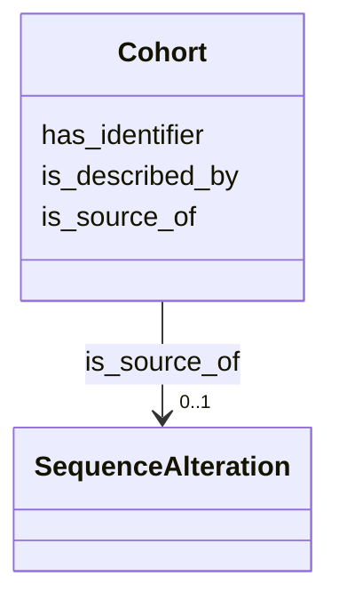

# Class: Cohort 


_Cohort role._


URI: [obi:0000252](http://purl.obolibrary.org/obo/OBI_0000252)





<!-- no inheritance hierarchy -->


## Slots

| Name | Cardinality and Range | Description | Inheritance |
| ---  | --- | --- | --- |
| [is_described_by](is_described_by.md) | 0..1 <br/> [String](String.md) | Is described by (e | direct |
| [is_source_of](is_source_of.md) | 0..1 <br/> [SequenceAlteration](SequenceAlteration.md) | Is source of (e | direct |
| [has_identifier](has_identifier.md) | 1 <br/> [String](String.md) | Relation between Cohort and its identifier | direct |


## Usages

| used by | used in | type | used |
| ---  | --- | --- | --- |
| [Cohort](Cohort.md) | [is_described_by](is_described_by.md) | domain | [Cohort](Cohort.md) |
| [Cohort](Cohort.md) | [is_source_of](is_source_of.md) | domain | [Cohort](Cohort.md) |
| [Cohort](Cohort.md) | [has_identifier](has_identifier.md) | domain | [Cohort](Cohort.md) |


## Identifier and Mapping Information


### Schema Source


* from schema: https://w3id.org/neugenfair/schema


## Mappings

| Mapping Type | Mapped Value |
| ---  | ---  |
| self | obi:0000252 |
| native | https://w3id.org/neugenfair/schema/Cohort |
| exact | ncit:C61512 |


## LinkML Source

<!-- TODO: investigate https://stackoverflow.com/questions/37606292/how-to-create-tabbed-code-blocks-in-mkdocs-or-sphinx -->

### Direct

<details>
```yaml
name: Cohort
description: Cohort role.
from_schema: https://w3id.org/neugenfair/schema
exact_mappings:
- ncit:C61512
attributes:
  is_described_by:
    name: is_described_by
    description: Is described by (e.g. publication, report).
    from_schema: https://w3id.org/neugenfair/schema
    exact_mappings:
    - sio:000557
    domain: Cohort
    slot_uri: sio:000557
    domain_of:
    - Cohort
    range: string
    required: false
  is_source_of:
    name: is_source_of
    description: Is source of (e.g. dataset, biobank, variant).
    from_schema: https://w3id.org/neugenfair/schema
    exact_mappings:
    - sio:000219
    domain: Cohort
    slot_uri: sio:000219
    domain_of:
    - Cohort
    range: SequenceAlteration
    required: false
  has_identifier:
    name: has_identifier
    description: Relation between Cohort and its identifier
    from_schema: https://w3id.org/neugenfair/schema
    mappings:
    - sio:0000671
    domain: Cohort
    slot_uri: sio:0000671
    domain_of:
    - Cohort
    - SequenceAlteration
    range: string
    required: true
class_uri: obi:0000252

```
</details>

### Induced

<details>
```yaml
name: Cohort
description: Cohort role.
from_schema: https://w3id.org/neugenfair/schema
exact_mappings:
- ncit:C61512
attributes:
  is_described_by:
    name: is_described_by
    description: Is described by (e.g. publication, report).
    from_schema: https://w3id.org/neugenfair/schema
    exact_mappings:
    - sio:000557
    domain: Cohort
    slot_uri: sio:000557
    alias: is_described_by
    owner: Cohort
    domain_of:
    - Cohort
    range: string
    required: false
  is_source_of:
    name: is_source_of
    description: Is source of (e.g. dataset, biobank, variant).
    from_schema: https://w3id.org/neugenfair/schema
    exact_mappings:
    - sio:000219
    domain: Cohort
    slot_uri: sio:000219
    alias: is_source_of
    owner: Cohort
    domain_of:
    - Cohort
    range: SequenceAlteration
    required: false
  has_identifier:
    name: has_identifier
    description: Relation between Cohort and its identifier
    from_schema: https://w3id.org/neugenfair/schema
    mappings:
    - sio:0000671
    domain: Cohort
    slot_uri: sio:0000671
    alias: has_identifier
    owner: Cohort
    domain_of:
    - Cohort
    - SequenceAlteration
    range: string
    required: true
class_uri: obi:0000252

```
</details>