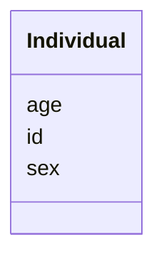

# Class: Individual 


_A study participant in a genomic/clinical cohort._


URI: [https://w3id.org/neugenfair/schema/Individual](https://w3id.org/neugenfair/schema/Individual)





<!-- no inheritance hierarchy -->


## Slots

| Name | Cardinality and Range | Description | Inheritance |
| ---  | --- | --- | --- |
| [id](id.md) | 1 <br/> [String](String.md) | Unique identifier for the individual | direct |
| [sex](sex.md) | 0..1 <br/> [String](String.md) | Biological sex of the individual | direct |
| [age](age.md) | 0..1 <br/> [Integer](Integer.md) | Age of the individual in years | direct |


## Identifier and Mapping Information


### Schema Source


* from schema: https://w3id.org/neugenfair/schema


## Mappings

| Mapping Type | Mapped Value |
| ---  | ---  |
| self | https://w3id.org/neugenfair/schema/Individual |
| native | https://w3id.org/neugenfair/schema/Individual |


## LinkML Source

<!-- TODO: investigate https://stackoverflow.com/questions/37606292/how-to-create-tabbed-code-blocks-in-mkdocs-or-sphinx -->

### Direct

<details>
```yaml
name: Individual
description: A study participant in a genomic/clinical cohort.
from_schema: https://w3id.org/neugenfair/schema
attributes:
  id:
    name: id
    description: Unique identifier for the individual.
    from_schema: https://w3id.org/neugenfair/schema
    rank: 1000
    identifier: true
    domain_of:
    - Individual
    range: string
    required: true
  sex:
    name: sex
    description: Biological sex of the individual.
    from_schema: https://w3id.org/neugenfair/schema
    rank: 1000
    domain_of:
    - Individual
    range: string
    required: false
  age:
    name: age
    description: Age of the individual in years.
    from_schema: https://w3id.org/neugenfair/schema
    rank: 1000
    domain_of:
    - Individual
    range: integer
    required: false

```
</details>

### Induced

<details>
```yaml
name: Individual
description: A study participant in a genomic/clinical cohort.
from_schema: https://w3id.org/neugenfair/schema
attributes:
  id:
    name: id
    description: Unique identifier for the individual.
    from_schema: https://w3id.org/neugenfair/schema
    rank: 1000
    identifier: true
    alias: id
    owner: Individual
    domain_of:
    - Individual
    range: string
  sex:
    name: sex
    description: Biological sex of the individual.
    from_schema: https://w3id.org/neugenfair/schema
    rank: 1000
    alias: sex
    owner: Individual
    domain_of:
    - Individual
    range: string
    required: false
  age:
    name: age
    description: Age of the individual in years.
    from_schema: https://w3id.org/neugenfair/schema
    rank: 1000
    alias: age
    owner: Individual
    domain_of:
    - Individual
    range: integer
    required: false

```
</details>