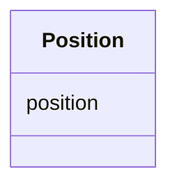

# Class: Position 


_(genomic) Position._


URI: [faldo:ExactPosition](http://biohackathon.org/resource/faldo#ExactPosition)





<!-- no inheritance hierarchy -->


## Slots

| Name | Cardinality and Range | Description | Inheritance |
| ---  | --- | --- | --- |
| [position](position.md) | 0..1 <br/> [String](String.md) |  | direct |


## Identifier and Mapping Information


### Schema Source


* from schema: https://w3id.org/neugenfair/schema


## Mappings

| Mapping Type | Mapped Value |
| ---  | ---  |
| self | faldo:ExactPosition |
| native | https://w3id.org/neugenfair/schema/Position |
| close | so:0000735 |


## LinkML Source

<!-- TODO: investigate https://stackoverflow.com/questions/37606292/how-to-create-tabbed-code-blocks-in-mkdocs-or-sphinx -->

### Direct

<details>
```yaml
name: Position
description: (genomic) Position.
from_schema: https://w3id.org/neugenfair/schema
close_mappings:
- so:0000735
attributes:
  position:
    name: position
    from_schema: https://w3id.org/neugenfair/schema
    rank: 1000
    domain_of:
    - Position
class_uri: faldo:ExactPosition

```
</details>

### Induced

<details>
```yaml
name: Position
description: (genomic) Position.
from_schema: https://w3id.org/neugenfair/schema
close_mappings:
- so:0000735
attributes:
  position:
    name: position
    from_schema: https://w3id.org/neugenfair/schema
    rank: 1000
    alias: position
    owner: Position
    domain_of:
    - Position
class_uri: faldo:ExactPosition

```
</details>