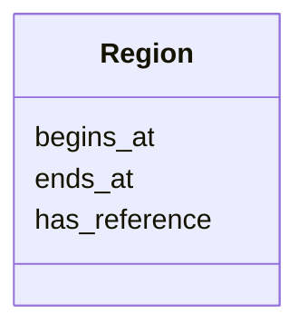

# Class: Region 


_(genomic) Region of a SequenceAlteration._


URI: [faldo:Region](http://biohackathon.org/resource/faldo#Region)





<!-- no inheritance hierarchy -->


## Slots

| Name | Cardinality and Range | Description | Inheritance |
| ---  | --- | --- | --- |
| [begins_at](begins_at.md) | 0..1 <br/> [String](String.md) |  | direct |
| [ends_at](ends_at.md) | 0..1 <br/> [String](String.md) |  | direct |
| [has_reference](has_reference.md) | 0..1 <br/> [String](String.md) |  | direct |


## Identifier and Mapping Information


### Schema Source


* from schema: https://w3id.org/neugenfair/schema


## Mappings

| Mapping Type | Mapped Value |
| ---  | ---  |
| self | faldo:Region |
| native | https://w3id.org/neugenfair/schema/Region |


## LinkML Source

<!-- TODO: investigate https://stackoverflow.com/questions/37606292/how-to-create-tabbed-code-blocks-in-mkdocs-or-sphinx -->

### Direct

<details>
```yaml
name: Region
description: (genomic) Region of a SequenceAlteration.
from_schema: https://w3id.org/neugenfair/schema
attributes:
  begins_at:
    name: begins_at
    from_schema: https://w3id.org/neugenfair/schema
    domain_of:
    - Region
  ends_at:
    name: ends_at
    from_schema: https://w3id.org/neugenfair/schema
    domain_of:
    - Region
  has_reference:
    name: has_reference
    from_schema: https://w3id.org/neugenfair/schema
    domain_of:
    - Region
class_uri: faldo:Region

```
</details>

### Induced

<details>
```yaml
name: Region
description: (genomic) Region of a SequenceAlteration.
from_schema: https://w3id.org/neugenfair/schema
attributes:
  begins_at:
    name: begins_at
    from_schema: https://w3id.org/neugenfair/schema
    alias: begins_at
    owner: Region
    domain_of:
    - Region
  ends_at:
    name: ends_at
    from_schema: https://w3id.org/neugenfair/schema
    alias: ends_at
    owner: Region
    domain_of:
    - Region
  has_reference:
    name: has_reference
    from_schema: https://w3id.org/neugenfair/schema
    alias: has_reference
    owner: Region
    domain_of:
    - Region
class_uri: faldo:Region

```
</details>