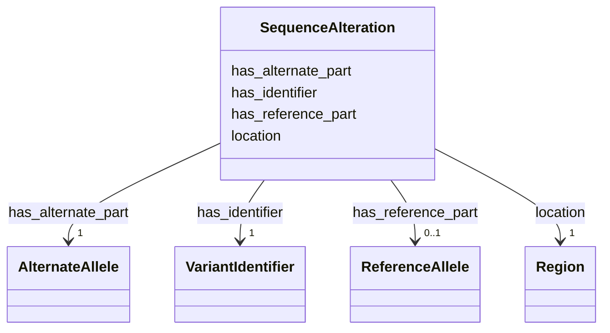

# Class: SequenceAlteration 


_A representation of a SequenceAlteration._


URI: [so:0001059](http://purl.obolibrary.org/obo/SO_0001059)





<!-- no inheritance hierarchy -->


## Slots

| Name | Cardinality and Range | Description | Inheritance |
| ---  | --- | --- | --- |
| [has_identifier](has_identifier.md) | 1 <br/> [VariantIdentifier](VariantIdentifier.md) | Relation between a SequenceAlteration and its VariantIdentifier | direct |
| [has_reference_part](has_reference_part.md) | 0..1 <br/> [ReferenceAllele](ReferenceAllele.md) | Links the SequenceAlteration to its ReferenceAllele | direct |
| [has_alternate_part](has_alternate_part.md) | 1 <br/> [AlternateAllele](AlternateAllele.md) | Links the SequenceAlteration to its AlternateAllele | direct |
| [location](location.md) | 1 <br/> [Region](Region.md) | Links the SequenceAlteration to its (genomic) Region | direct |


## Usages

| used by | used in | type | used |
| ---  | --- | --- | --- |
| [Cohort](Cohort.md) | [is_source_of](is_source_of.md) | range | [SequenceAlteration](SequenceAlteration.md) |
| [SequenceAlteration](SequenceAlteration.md) | [has_identifier](has_identifier.md) | domain | [SequenceAlteration](SequenceAlteration.md) |
| [SequenceAlteration](SequenceAlteration.md) | [has_reference_part](has_reference_part.md) | domain | [SequenceAlteration](SequenceAlteration.md) |
| [SequenceAlteration](SequenceAlteration.md) | [has_alternate_part](has_alternate_part.md) | domain | [SequenceAlteration](SequenceAlteration.md) |
| [SequenceAlteration](SequenceAlteration.md) | [location](location.md) | domain | [SequenceAlteration](SequenceAlteration.md) |


## Identifier and Mapping Information


### Schema Source


* from schema: https://w3id.org/neugenfair/schema


## Mappings

| Mapping Type | Mapped Value |
| ---  | ---  |
| self | so:0001059 |
| native | https://w3id.org/neugenfair/schema/SequenceAlteration |
| exact | geno:0000660 |


## LinkML Source

<!-- TODO: investigate https://stackoverflow.com/questions/37606292/how-to-create-tabbed-code-blocks-in-mkdocs-or-sphinx -->

### Direct

<details>
```yaml
name: SequenceAlteration
description: A representation of a SequenceAlteration.
from_schema: https://w3id.org/neugenfair/schema
exact_mappings:
- geno:0000660
attributes:
  has_identifier:
    name: has_identifier
    description: Relation between a SequenceAlteration and its VariantIdentifier
    from_schema: https://w3id.org/neugenfair/schema
    mappings:
    - sio:0000671
    domain: SequenceAlteration
    slot_uri: sio:0000671
    domain_of:
    - Cohort
    - SequenceAlteration
    range: VariantIdentifier
    required: true
  has_reference_part:
    name: has_reference_part
    description: Links the SequenceAlteration to its ReferenceAllele.
    from_schema: https://w3id.org/neugenfair/schema
    exact_mappings:
    - geno:0000385
    domain: SequenceAlteration
    slot_uri: geno:0000385
    domain_of:
    - SequenceAlteration
    range: ReferenceAllele
    required: false
  has_alternate_part:
    name: has_alternate_part
    description: Links the SequenceAlteration to its AlternateAllele.
    from_schema: https://w3id.org/neugenfair/schema
    exact_mappings:
    - geno:0000382
    domain: SequenceAlteration
    slot_uri: geno:0000382
    domain_of:
    - SequenceAlteration
    range: AlternateAllele
    required: true
  location:
    name: location
    description: Links the SequenceAlteration to its (genomic) Region.
    from_schema: https://w3id.org/neugenfair/schema
    exact_mappings:
    - faldo:location
    domain: SequenceAlteration
    slot_uri: faldo:location
    domain_of:
    - SequenceAlteration
    range: Region
    required: true
class_uri: so:0001059

```
</details>

### Induced

<details>
```yaml
name: SequenceAlteration
description: A representation of a SequenceAlteration.
from_schema: https://w3id.org/neugenfair/schema
exact_mappings:
- geno:0000660
attributes:
  has_identifier:
    name: has_identifier
    description: Relation between a SequenceAlteration and its VariantIdentifier
    from_schema: https://w3id.org/neugenfair/schema
    mappings:
    - sio:0000671
    domain: SequenceAlteration
    slot_uri: sio:0000671
    alias: has_identifier
    owner: SequenceAlteration
    domain_of:
    - Cohort
    - SequenceAlteration
    range: VariantIdentifier
    required: true
  has_reference_part:
    name: has_reference_part
    description: Links the SequenceAlteration to its ReferenceAllele.
    from_schema: https://w3id.org/neugenfair/schema
    exact_mappings:
    - geno:0000385
    domain: SequenceAlteration
    slot_uri: geno:0000385
    alias: has_reference_part
    owner: SequenceAlteration
    domain_of:
    - SequenceAlteration
    range: ReferenceAllele
    required: false
  has_alternate_part:
    name: has_alternate_part
    description: Links the SequenceAlteration to its AlternateAllele.
    from_schema: https://w3id.org/neugenfair/schema
    exact_mappings:
    - geno:0000382
    domain: SequenceAlteration
    slot_uri: geno:0000382
    alias: has_alternate_part
    owner: SequenceAlteration
    domain_of:
    - SequenceAlteration
    range: AlternateAllele
    required: true
  location:
    name: location
    description: Links the SequenceAlteration to its (genomic) Region.
    from_schema: https://w3id.org/neugenfair/schema
    exact_mappings:
    - faldo:location
    domain: SequenceAlteration
    slot_uri: faldo:location
    alias: location
    owner: SequenceAlteration
    domain_of:
    - SequenceAlteration
    range: Region
    required: true
class_uri: so:0001059

```
</details>