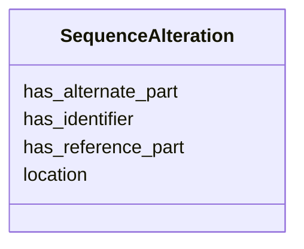

# Class: SequenceAlteration 


_A representation of a SequenceAlteration._


URI: [so:0001059](http://purl.obolibrary.org/obo/SO_0001059)





<!-- no inheritance hierarchy -->


## Slots

| Name | Cardinality and Range | Description | Inheritance |
| ---  | --- | --- | --- |
| [has_identifier](has_identifier.md) | 0..1 <br/> [String](String.md) |  | direct |
| [has_reference_part](has_reference_part.md) | 0..1 <br/> [String](String.md) |  | direct |
| [has_alternate_part](has_alternate_part.md) | 0..1 <br/> [String](String.md) |  | direct |
| [location](location.md) | 0..1 <br/> [String](String.md) |  | direct |


## Identifier and Mapping Information


### Schema Source


* from schema: https://w3id.org/neugenfair/schema


## Mappings

| Mapping Type | Mapped Value |
| ---  | ---  |
| self | so:0001059 |
| native | https://w3id.org/neugenfair/schema/SequenceAlteration |
| exact | geno:0000660 |


## LinkML Source

<!-- TODO: investigate https://stackoverflow.com/questions/37606292/how-to-create-tabbed-code-blocks-in-mkdocs-or-sphinx -->

### Direct

<details>
```yaml
name: SequenceAlteration
description: A representation of a SequenceAlteration.
from_schema: https://w3id.org/neugenfair/schema
exact_mappings:
- geno:0000660
attributes:
  has_identifier:
    name: has_identifier
    from_schema: https://w3id.org/neugenfair/schema
    domain_of:
    - SequenceAlteration
  has_reference_part:
    name: has_reference_part
    from_schema: https://w3id.org/neugenfair/schema
    domain_of:
    - SequenceAlteration
  has_alternate_part:
    name: has_alternate_part
    from_schema: https://w3id.org/neugenfair/schema
    domain_of:
    - SequenceAlteration
  location:
    name: location
    from_schema: https://w3id.org/neugenfair/schema
    domain_of:
    - SequenceAlteration
class_uri: so:0001059

```
</details>

### Induced

<details>
```yaml
name: SequenceAlteration
description: A representation of a SequenceAlteration.
from_schema: https://w3id.org/neugenfair/schema
exact_mappings:
- geno:0000660
attributes:
  has_identifier:
    name: has_identifier
    from_schema: https://w3id.org/neugenfair/schema
    alias: has_identifier
    owner: SequenceAlteration
    domain_of:
    - SequenceAlteration
  has_reference_part:
    name: has_reference_part
    from_schema: https://w3id.org/neugenfair/schema
    alias: has_reference_part
    owner: SequenceAlteration
    domain_of:
    - SequenceAlteration
  has_alternate_part:
    name: has_alternate_part
    from_schema: https://w3id.org/neugenfair/schema
    alias: has_alternate_part
    owner: SequenceAlteration
    domain_of:
    - SequenceAlteration
  location:
    name: location
    from_schema: https://w3id.org/neugenfair/schema
    alias: location
    owner: SequenceAlteration
    domain_of:
    - SequenceAlteration
class_uri: so:0001059

```
</details>