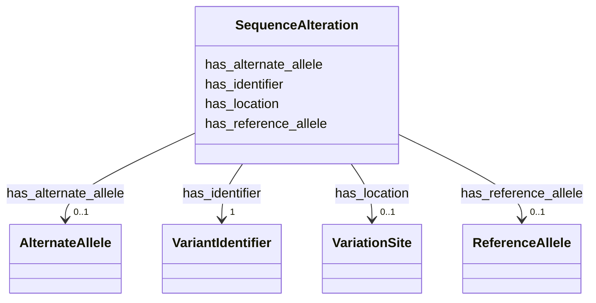

# Class: SequenceAlteration 


_A representation of a sequence alteration (so:0001059)._


URI: [so:0001059](http://purl.obolibrary.org/obo/SO_0001059)





<!-- no inheritance hierarchy -->


## Slots

| Name | Cardinality and Range | Description | Inheritance |
| ---  | --- | --- | --- |
| [has_identifier](has_identifier.md) | 1 <br/> [VariantIdentifier](VariantIdentifier.md) | A unique identifier for the sequence alteration | direct |
| [has_reference_allele](has_reference_allele.md) | 0..1 <br/> [ReferenceAllele](ReferenceAllele.md) | Links the sequence alteration to its reference allele | direct |
| [has_alternate_allele](has_alternate_allele.md) | 0..1 <br/> [AlternateAllele](AlternateAllele.md) | Links the sequence alteration to its alternate allele | direct |
| [has_location](has_location.md) | 0..1 <br/> [VariationSite](VariationSite.md) | Links the sequence alteration to its location | direct |


## Identifier and Mapping Information


### Schema Source


* from schema: https://w3id.org/neugenfair/schema


## Mappings

| Mapping Type | Mapped Value |
| ---  | ---  |
| self | so:0001059 |
| native | https://w3id.org/neugenfair/schema/SequenceAlteration |
| exact | geno:0000660 |


## LinkML Source

<!-- TODO: investigate https://stackoverflow.com/questions/37606292/how-to-create-tabbed-code-blocks-in-mkdocs-or-sphinx -->

### Direct

<details>
```yaml
name: SequenceAlteration
description: A representation of a sequence alteration (so:0001059).
from_schema: https://w3id.org/neugenfair/schema
exact_mappings:
- geno:0000660
attributes:
  has_identifier:
    name: has_identifier
    description: A unique identifier for the sequence alteration.
    from_schema: https://w3id.org/neugenfair/schema
    rank: 1000
    slot_uri: sio:000674
    domain_of:
    - SequenceAlteration
    range: VariantIdentifier
    required: true
  has_reference_allele:
    name: has_reference_allele
    description: Links the sequence alteration to its reference allele.
    from_schema: https://w3id.org/neugenfair/schema
    rank: 1000
    slot_uri: geno:0000385
    domain_of:
    - SequenceAlteration
    range: ReferenceAllele
    required: false
  has_alternate_allele:
    name: has_alternate_allele
    description: Links the sequence alteration to its alternate allele.
    from_schema: https://w3id.org/neugenfair/schema
    rank: 1000
    slot_uri: geno:0000382
    domain_of:
    - SequenceAlteration
    range: AlternateAllele
    required: false
  has_location:
    name: has_location
    description: Links the sequence alteration to its location.
    from_schema: https://w3id.org/neugenfair/schema
    rank: 1000
    slot_uri: faldo:location
    domain_of:
    - SequenceAlteration
    range: VariationSite
    required: false
class_uri: so:0001059

```
</details>

### Induced

<details>
```yaml
name: SequenceAlteration
description: A representation of a sequence alteration (so:0001059).
from_schema: https://w3id.org/neugenfair/schema
exact_mappings:
- geno:0000660
attributes:
  has_identifier:
    name: has_identifier
    description: A unique identifier for the sequence alteration.
    from_schema: https://w3id.org/neugenfair/schema
    rank: 1000
    slot_uri: sio:000674
    alias: has_identifier
    owner: SequenceAlteration
    domain_of:
    - SequenceAlteration
    range: VariantIdentifier
    required: true
  has_reference_allele:
    name: has_reference_allele
    description: Links the sequence alteration to its reference allele.
    from_schema: https://w3id.org/neugenfair/schema
    rank: 1000
    slot_uri: geno:0000385
    alias: has_reference_allele
    owner: SequenceAlteration
    domain_of:
    - SequenceAlteration
    range: ReferenceAllele
    required: false
  has_alternate_allele:
    name: has_alternate_allele
    description: Links the sequence alteration to its alternate allele.
    from_schema: https://w3id.org/neugenfair/schema
    rank: 1000
    slot_uri: geno:0000382
    alias: has_alternate_allele
    owner: SequenceAlteration
    domain_of:
    - SequenceAlteration
    range: AlternateAllele
    required: false
  has_location:
    name: has_location
    description: Links the sequence alteration to its location.
    from_schema: https://w3id.org/neugenfair/schema
    rank: 1000
    slot_uri: faldo:location
    alias: has_location
    owner: SequenceAlteration
    domain_of:
    - SequenceAlteration
    range: VariationSite
    required: false
class_uri: so:0001059

```
</details>