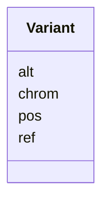

# Class: Variant 


_A genomic variant observed in the study._


URI: [https://w3id.org/neugenfair/schema/Variant](https://w3id.org/neugenfair/schema/Variant)





<!-- no inheritance hierarchy -->


## Slots

| Name | Cardinality and Range | Description | Inheritance |
| ---  | --- | --- | --- |
| [chrom](chrom.md) | 0..1 <br/> [String](String.md) | Chromosome (e | direct |
| [pos](pos.md) | 0..1 <br/> [Integer](Integer.md) | 1-based position of the variant on the chromosome | direct |
| [ref](ref.md) | 0..1 <br/> [String](String.md) | Reference allele | direct |
| [alt](alt.md) | 0..1 <br/> [String](String.md) | Alternate allele | direct |


## Identifier and Mapping Information


### Schema Source


* from schema: https://w3id.org/neugenfair/schema


## Mappings

| Mapping Type | Mapped Value |
| ---  | ---  |
| self | https://w3id.org/neugenfair/schema/Variant |
| native | https://w3id.org/neugenfair/schema/Variant |


## LinkML Source

<!-- TODO: investigate https://stackoverflow.com/questions/37606292/how-to-create-tabbed-code-blocks-in-mkdocs-or-sphinx -->

### Direct

<details>
```yaml
name: Variant
description: A genomic variant observed in the study.
from_schema: https://w3id.org/neugenfair/schema
attributes:
  chrom:
    name: chrom
    description: Chromosome (e.g. '1', 'X', 'MT').
    from_schema: https://w3id.org/neugenfair/schema
    rank: 1000
    domain_of:
    - Variant
    range: string
  pos:
    name: pos
    description: 1-based position of the variant on the chromosome.
    from_schema: https://w3id.org/neugenfair/schema
    rank: 1000
    domain_of:
    - Variant
    range: integer
  ref:
    name: ref
    description: Reference allele.
    from_schema: https://w3id.org/neugenfair/schema
    rank: 1000
    domain_of:
    - Variant
    range: string
  alt:
    name: alt
    description: Alternate allele.
    from_schema: https://w3id.org/neugenfair/schema
    rank: 1000
    domain_of:
    - Variant
    range: string

```
</details>

### Induced

<details>
```yaml
name: Variant
description: A genomic variant observed in the study.
from_schema: https://w3id.org/neugenfair/schema
attributes:
  chrom:
    name: chrom
    description: Chromosome (e.g. '1', 'X', 'MT').
    from_schema: https://w3id.org/neugenfair/schema
    rank: 1000
    alias: chrom
    owner: Variant
    domain_of:
    - Variant
    range: string
  pos:
    name: pos
    description: 1-based position of the variant on the chromosome.
    from_schema: https://w3id.org/neugenfair/schema
    rank: 1000
    alias: pos
    owner: Variant
    domain_of:
    - Variant
    range: integer
  ref:
    name: ref
    description: Reference allele.
    from_schema: https://w3id.org/neugenfair/schema
    rank: 1000
    alias: ref
    owner: Variant
    domain_of:
    - Variant
    range: string
  alt:
    name: alt
    description: Alternate allele.
    from_schema: https://w3id.org/neugenfair/schema
    rank: 1000
    alias: alt
    owner: Variant
    domain_of:
    - Variant
    range: string

```
</details>