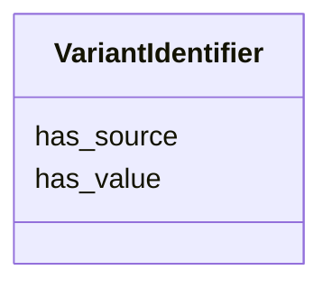

# Class: VariantIdentifier 


_A unique identifier for a sequence alteration within a database or nomenclature._


URI: [sio:000675](http://semanticscience.org/resource/SIO_000675)





<!-- no inheritance hierarchy -->


## Slots

| Name | Cardinality and Range | Description | Inheritance |
| ---  | --- | --- | --- |
| [has_value](has_value.md) | 0..1 <br/> [String](String.md) |  | direct |
| [has_source](has_source.md) | 0..1 <br/> [String](String.md) |  | direct |


## Identifier and Mapping Information


### Schema Source


* from schema: https://w3id.org/neugenfair/schema


## Mappings

| Mapping Type | Mapped Value |
| ---  | ---  |
| self | sio:000675 |
| native | https://w3id.org/neugenfair/schema/VariantIdentifier |


## LinkML Source

<!-- TODO: investigate https://stackoverflow.com/questions/37606292/how-to-create-tabbed-code-blocks-in-mkdocs-or-sphinx -->

### Direct

<details>
```yaml
name: VariantIdentifier
description: A unique identifier for a sequence alteration within a database or nomenclature.
from_schema: https://w3id.org/neugenfair/schema
attributes:
  has_value:
    name: has_value
    from_schema: https://w3id.org/neugenfair/schema
    domain_of:
    - AssemblySequence
    - VariantIdentifier
  has_source:
    name: has_source
    from_schema: https://w3id.org/neugenfair/schema
    domain_of:
    - VariantIdentifier
class_uri: sio:000675

```
</details>

### Induced

<details>
```yaml
name: VariantIdentifier
description: A unique identifier for a sequence alteration within a database or nomenclature.
from_schema: https://w3id.org/neugenfair/schema
attributes:
  has_value:
    name: has_value
    from_schema: https://w3id.org/neugenfair/schema
    alias: has_value
    owner: VariantIdentifier
    domain_of:
    - AssemblySequence
    - VariantIdentifier
  has_source:
    name: has_source
    from_schema: https://w3id.org/neugenfair/schema
    alias: has_source
    owner: VariantIdentifier
    domain_of:
    - VariantIdentifier
class_uri: sio:000675

```
</details>