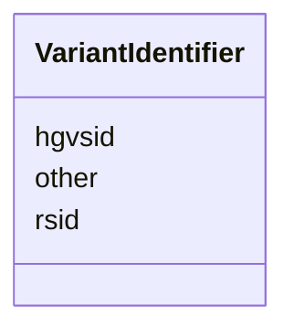

# Class: VariantIdentifier 


_A unique identifier for a sequence alteration._


URI: [sio:000675](http://semanticscience.org/resource/SIO_000675)





<!-- no inheritance hierarchy -->


## Slots

| Name | Cardinality and Range | Description | Inheritance |
| ---  | --- | --- | --- |
| [hgvsid](hgvsid.md) | 1 <br/> [String](String.md) | HGVSid | direct |
| [rsid](rsid.md) | 0..1 <br/> [String](String.md) | dbsnp rsid | direct |
| [other](other.md) | 0..1 <br/> [String](String.md) | Other identifiers | direct |


## Usages

| used by | used in | type | used |
| ---  | --- | --- | --- |
| [SequenceAlteration](SequenceAlteration.md) | [has_identifier](has_identifier.md) | range | [VariantIdentifier](VariantIdentifier.md) |


## Identifier and Mapping Information


### Schema Source


* from schema: https://w3id.org/neugenfair/schema


## Mappings

| Mapping Type | Mapped Value |
| ---  | ---  |
| self | sio:000675 |
| native | https://w3id.org/neugenfair/schema/VariantIdentifier |


## LinkML Source

<!-- TODO: investigate https://stackoverflow.com/questions/37606292/how-to-create-tabbed-code-blocks-in-mkdocs-or-sphinx -->

### Direct

<details>
```yaml
name: VariantIdentifier
description: A unique identifier for a sequence alteration.
from_schema: https://w3id.org/neugenfair/schema
attributes:
  hgvsid:
    name: hgvsid
    description: HGVSid. identifier
    from_schema: https://w3id.org/neugenfair/schema
    rank: 1000
    slot_uri: sio:000300
    domain_of:
    - VariantIdentifier
    range: string
    required: true
  rsid:
    name: rsid
    description: dbsnp rsid.
    from_schema: https://w3id.org/neugenfair/schema
    rank: 1000
    slot_uri: sio:000300
    domain_of:
    - VariantIdentifier
    range: string
    required: false
  other:
    name: other
    description: Other identifiers.
    from_schema: https://w3id.org/neugenfair/schema
    rank: 1000
    slot_uri: sio:000300
    domain_of:
    - VariantIdentifier
    range: string
    required: false
class_uri: sio:000675

```
</details>

### Induced

<details>
```yaml
name: VariantIdentifier
description: A unique identifier for a sequence alteration.
from_schema: https://w3id.org/neugenfair/schema
attributes:
  hgvsid:
    name: hgvsid
    description: HGVSid. identifier
    from_schema: https://w3id.org/neugenfair/schema
    rank: 1000
    slot_uri: sio:000300
    alias: hgvsid
    owner: VariantIdentifier
    domain_of:
    - VariantIdentifier
    range: string
    required: true
  rsid:
    name: rsid
    description: dbsnp rsid.
    from_schema: https://w3id.org/neugenfair/schema
    rank: 1000
    slot_uri: sio:000300
    alias: rsid
    owner: VariantIdentifier
    domain_of:
    - VariantIdentifier
    range: string
    required: false
  other:
    name: other
    description: Other identifiers.
    from_schema: https://w3id.org/neugenfair/schema
    rank: 1000
    slot_uri: sio:000300
    alias: other
    owner: VariantIdentifier
    domain_of:
    - VariantIdentifier
    range: string
    required: false
class_uri: sio:000675

```
</details>